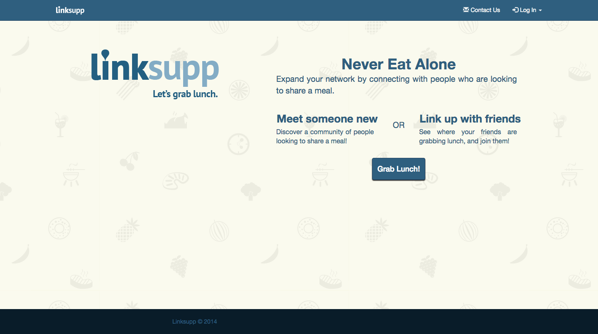
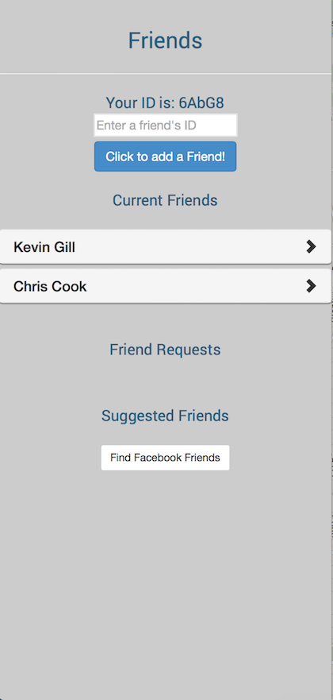
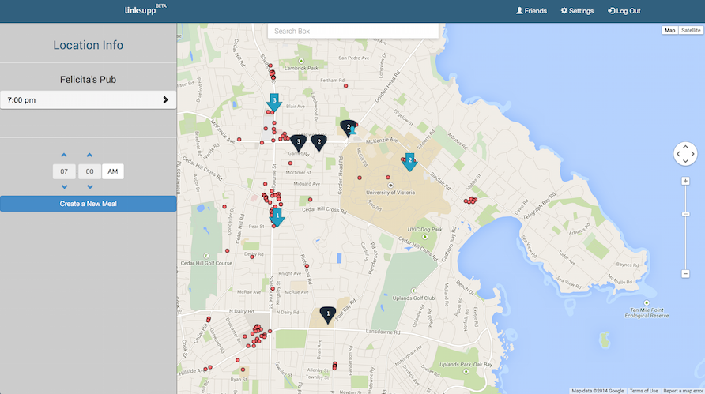

linksupp
====

##Description
A web application that is aimed for business savvy, outgoing groups of people who are looking for opportunities to meet new contacts, and expand their friend base by meeting people informally for a meal.

##Getting Started
Please note: We have not included our config.js file in the repository as it contains passwords to our database. You will not be able to download and run our app without it. To obtain a copy of the config file please contact a member of our group. Once you have the config file, it needs to be placed in the app folder. However, you can visit the web app as seen below.

To run our app, you must have node.js installed. Once installed navigate into the app folder on the command line and run our server with the command "node main.js". Then open a broswer and navigate to "http://localhost:3000/".

##Demo
View our demo [here](http://youtu.be/6ol6h0DApqQ)!

Link to the web app: http://mangiamo-app.elasticbeanstalk.com/

##Resources
The Google folder, where you can find a lot of the resources, are here: https://drive.google.com/folderview?id=0B273SDwCaBm_a3U0aUZENTdXZTQ&usp=drive_web

